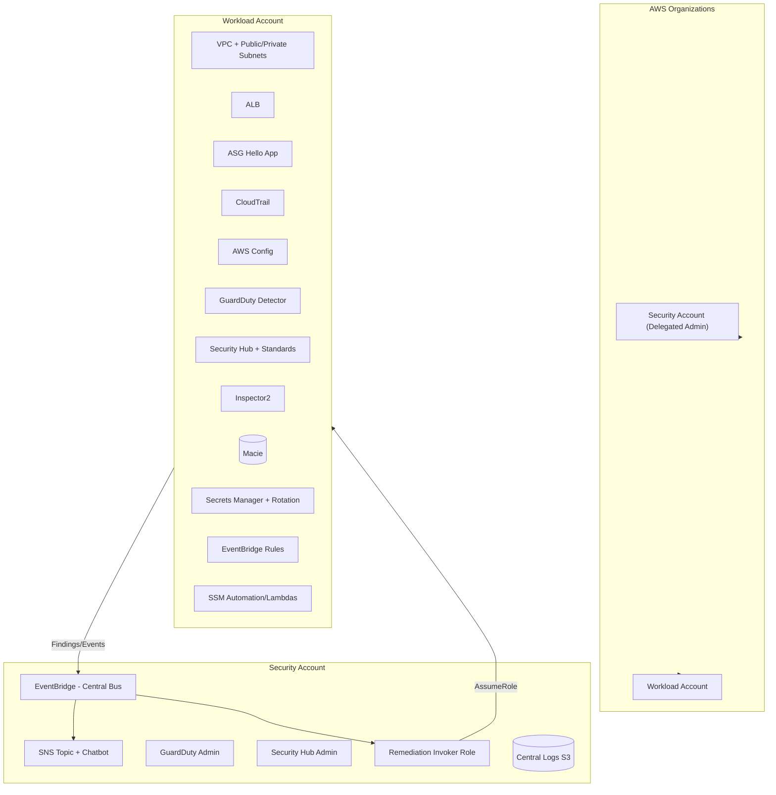

# AWS Incident‑Response Pro Lab (Multi‑Account, Paid Services)

A production‑style security lab across **two accounts**: a **Security** account (centralized admin + notifications) and a **Workload** account (demo app + findings). Uses paid services like **GuardDuty**, **Security Hub**, **Inspector**, and optional **Macie/Detective**.

---

## 🗺️ Architecture Diagram



---

## Prerequisites

- An AWS **Organization** with at least two member accounts:
  - **Security account** (for central bus and alerts)
  - **Workload account** (where demo app and detections run)
- Permissions in the Org to create stacks in both accounts.
- One **region** chosen for both stacks.
- An **email** address for central alerts.

> If you don’t have an Organization yet, create one in the management/payer account, then create or invite the two member accounts.

---

## Deploy in the Security account

1. Switch to the **Security** account in the console.  
2. Go to **CloudFormation → Create stack** → upload `cloudformation/pro-security-account.yaml`.
3. Parameters:
   - **AlertsEmail**: your email (confirm the SNS subscription email).
   - **OrgDelegatedAdmin**: `false` (per‑account demo). If you run as delegated admin, set `true` and ensure org permissions.
4. Create the stack.

**What this creates**
- **SNS topic** for alerts.  
- **Central EventBridge bus** (accepts events from the Organization).  
- **Security Hub** hub + standards enabled (in the Security account).  
- **GuardDuty detector** (in the Security account).  
- **Output**: **CentralEventBusArn** — copy this for the workload stack.

---

## Deploy in the Workload account

1. Switch to the **Workload** account.  
2. **CloudFormation → Create stack** → upload `cloudformation/pro-workload-account.yaml`.
3. Parameters:
   - **SecurityAccountId**: the Security account ID (12 digits).
   - **SecurityEventBusArn**: paste the value from the Security stack output.
   - **CreateDemoApp**: `true` (creates ALB + ASG hello site).
   - **EnableMacie**: `false` or `true` (optional).
4. Create the stack.

**What this creates**
- **VPC + ALB + Auto Scaling Group** (2 EC2 web servers).  
- **GuardDuty** and **Security Hub** enabled.  
- **Inspector v2** placeholder (note: enabling full Inspector org coverage requires delegated admin; outside the scope of this minimal demo).  
- **EventBridge rule** to forward GuardDuty/SecHub events to the **central bus**.  
- **Quarantine Lambda**: if a finding includes an EC2 instance ID, it **replaces SGs** with a “prolab‑quarantine” SG (no ingress/egress).

---

## Console pointers you’ll use

- **Security account**:  
  - **EventBridge** → Event buses → `prolab-central-bus`  
  - **SNS** → Subscriptions (confirm **Confirmed**)  
  - **CloudWatch Logs** (if you add logs in extensions)
- **Workload account**:  
  - **EC2** → Auto Scaling Group instances (app servers)  
  - **GuardDuty** → Findings  
  - **Security Hub** → Findings, Insights  
  - **EventBridge** → Rules → `ToCentralBus`  
  - **CloudWatch Logs** → `/aws/lambda/<stack>-QuarantineFn-...`

---

## Demo 1 — Cross‑account forwarding of GuardDuty findings

**Goal**: Generate findings in the Workload account; see them forwarded to the Security account’s central bus and alerted via SNS.

1. Switch to **Workload** account → **GuardDuty** → **Settings** → **Generate sample findings**.  
2. Switch to **Security** account → **EventBridge → prolab-central-bus → Monitoring**.  
   - You should see **recent events** arriving.  
3. **SNS Email** (Security account): confirm you receive alerts if you’ve wired a rule/target (you can also add a simple rule in the Security account that sends all events from the central bus to SNS during the demo).

> Note: The template forwards events to the central bus. To fan out to SNS/Chat, add an EventBridge rule **in the Security account** with target = SNS.

---

## Demo 2 — EC2 quarantine (auto‑remediation example)

**Goal**: When a high‑severity finding references an EC2 instance, the **QuarantineFn** in the Workload account **replaces SGs** with a lock‑down SG.

### Option A — Real finding that references an instance
If you already have a finding tied to one of the ASG instances (e.g., a GuardDuty UnauthorizedAccess on EC2), the rule will invoke the function automatically.

**What to check**
- **EC2 → Instances**: the target instance’s Security Groups now only include **`prolab-quarantine`**.  
- **CloudWatch Logs**: `/aws/lambda/<stack>-QuarantineFn-...` shows `{ "quarantined": "<instance-id>", "sg": "<sg-id>" }`.

### Option B — Manual test event (reliable for the demo)
1. Workload account → **Lambda → QuarantineFn → Test**.  
2. Create a **new test event** using this **Security Hub shape**; replace `<INSTANCE_ID>` and `<VPC_ID>` with one of your ASG instances:

```json
{
  "detail": {
    "findings": [{
      "Resources": [{
        "Type": "AwsEc2Instance",
        "Id": "arn:aws:ec2:REGION:ACCOUNT:instance/<INSTANCE_ID>",
        "Details": { "AwsEc2Instance": { "VpcId": "<VPC_ID>" } }
      }]
    }]
  }
}
```

3. **Test** to invoke.  

**What to check**
- **EC2 → Instances**: the instance now shows Security Group **`prolab-quarantine`** only.  
- **CloudWatch Logs**: shows the quarantine action.

> To restore, re‑attach your app instance SGs or terminate the quarantined instance and let ASG replace it.

---

## 🔧 Troubleshooting

- **Can’t deploy Security stack with OrgDelegatedAdmin=true**  
  - You need to run it from the Org management account first to delegate.  
  - For demo, set `OrgDelegatedAdmin=false`.  
- **No alerts in Security account**  
  - Check SNS subscription is **Confirmed**.  
  - Add an EventBridge rule in the Security account to route events from `prolab-central-bus` to SNS.  
- **No GuardDuty findings**  
  - In the Workload account, go to GuardDuty → Settings → **Generate sample findings**.  
- **Quarantine Lambda didn’t work**  
  - Ensure the finding/event included an **EC2 instanceId + vpcId**.  
  - Use the manual test JSON payload provided above.  
- **Stacks won’t delete**  
  - Delete **Workload stack first**, then **Security stack**.  
  - Ensure NAT gateways, Elastic IPs, or ASGs are not stuck (retry after 1–2 min).  

---

## Cleanup

1. **Workload** account: delete the **pro‑workload** stack (it removes VPC/ALB/ASG/Lambdas).  
2. **Security** account: delete the **pro‑security** stack.  
3. If you created extra EventBridge rules or Chatbot configs, remove those too.
