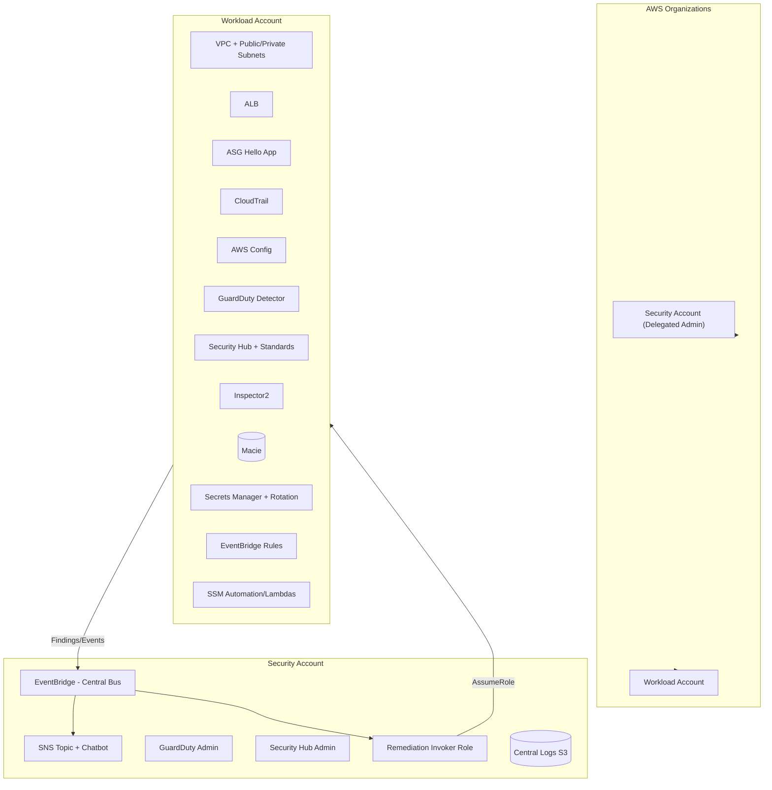

# AWS Incident-Response Pro Lab (Multi-Account, Paid Services)

This repo contains a **production-style security lab** that uses **multiple AWS accounts** and **paid security services** to demonstrate *detect → alert → investigate → auto-remediate* at scale.

## What you’ll build

**Accounts (min 2)**
- **Security account (delegated admin)**: GuardDuty admin, Security Hub admin, central EventBridge bus, SNS/Chat, dashboards, cross-account remediation role.
- **Workload account**: Demo app (ALB + ASG), data stores, and resources to “break” safely.

**Paid services used**
- **GuardDuty** (threat findings)
- **Security Hub** (+ CIS AWS Foundations v1.4/2.0, Foundational Security Best Practices standards)
- **Inspector2** (EC2/ECR vuln scanning)
- **Macie (optional)** (S3 PII discovery)
- **Secrets Manager** (managed secret rotation)
- **Detective (optional)** (investigation graph)
- **AWS Config** (conformance/controls)
- **Systems Manager** (Automation/Runbooks)
- **EventBridge + SNS + Chatbot** (notifications & routing)

> ⚠️ **Costs**: These services incur charges. Keep the lab small, run in a short window, and delete stacks afterwards.

---

## High-level architecture



---

## Repository layout

```
cloudformation/
  pro-security-account.yaml   # to deploy in Security account
  pro-workload-account.yaml   # to deploy in Workload account
docs/
  architecture.md
.github/workflows/
  cfn-validate.yml            # CI lint on PRs
LICENSE
README.md
.gitignore
```

---

## Prereqs

- An AWS **Organization** with at least 2 accounts:
  - **Security account ID** (admin)
  - **Workload account ID**
- You are signed in with **Org management** permissions to delegate admin.
- Choose a **region** (same region for both stacks).
- Slack/Teams workspace (optional) for AWS Chatbot.

> If you don’t have an Organization yet, create one in the **Management (payer) account**, then create/invite the two member accounts.

---

## Deploy (order matters)

### 1) In the **Security account**
- Deploy `cloudformation/pro-security-account.yaml`.
- Parameters:
  - `OrgDelegatedAdmin` = `true` (requires org permissions); set `false` if already delegated.
  - `AlertsEmail` = your email (confirm SNS subscription).
  - `EnableDetective` / `EnableSecurityLake` / `EnableMacieOrg` = as desired (optional).
- This stack:
  - Enables **GuardDuty admin** & **Security Hub admin**.
  - Creates **central EventBridge bus** with resource policy to accept events from the workload account.
  - Creates **SNS topic** and **Chatbot** (manual Slack connect later).
  - Creates **RemediationInvokerRole** (assumable from Security account → Workload account execution role).

### 2) In the **Workload account**
- Deploy `cloudformation/pro-workload-account.yaml`.
- Parameters:
  - `SecurityAccountId` = the security account ID
  - `SecurityEventBusArn` = the central bus ARN (from Outputs of step 1)
  - `CreateDemoApp` = `true`
  - `EnableMacie` = `false|true`
- This stack:
  - Builds a small **ALB + ASG hello site**.
  - Enables **GuardDuty detector**, **Security Hub** (+ standards), **Inspector2**, **AWS Config**.
  - Sets **EventBridge rules** to:
    - Forward findings to the **Security bus**
    - Trigger **auto-remediation runbooks** (SSM/Lambda)
  - Creates remediation runbooks for:
    - **Quarantine EC2** on severe GuardDuty findings
    - **Close public S3** (BPA, policy/ACL repair)
    - **Force patch** for noncompliant instances
    - **Rotate Secrets Manager secret now**
    - **Disable/rotate stale IAM keys**

---

## Demo scenarios

1. **GuardDuty high severity** (use *Generate sample findings*) → instance gets **quarantined**, snapshots taken, Slack/SNS alert.
2. **S3 public exposure** (edit bucket policy to `Principal:"*"`) → auto **block public access**, policy stripped, alert + audit log.
3. **Secrets Manager rotation** (set rotation disabled / nearing expiry) → **auto-enable & rotate** via rotation Lambda, alert with new version.
4. **Inspector critical CVE on EC2** → EventBridge rule triggers **patch runbook**, alert with before/after compliance.
5. **Stale IAM access keys** (age threshold) → **disable** and rotate (store in Secrets Manager), notify owner.

> Open **Security Hub** Insights to see findings aggregate across accounts; drill into **GuardDuty** for details; use **Detective** (if enabled) for relationships.

---

## Clean up

Delete the **Workload account** stack first, then the **Security account** stack. Disable org-wide admins if you turned them on just for the demo.

---

## Costs

These services are billed; keep resources to minimum and delete when you’re done. Typical small demo in a single region is a few dollars/day depending on findings volume and Macie scans.

