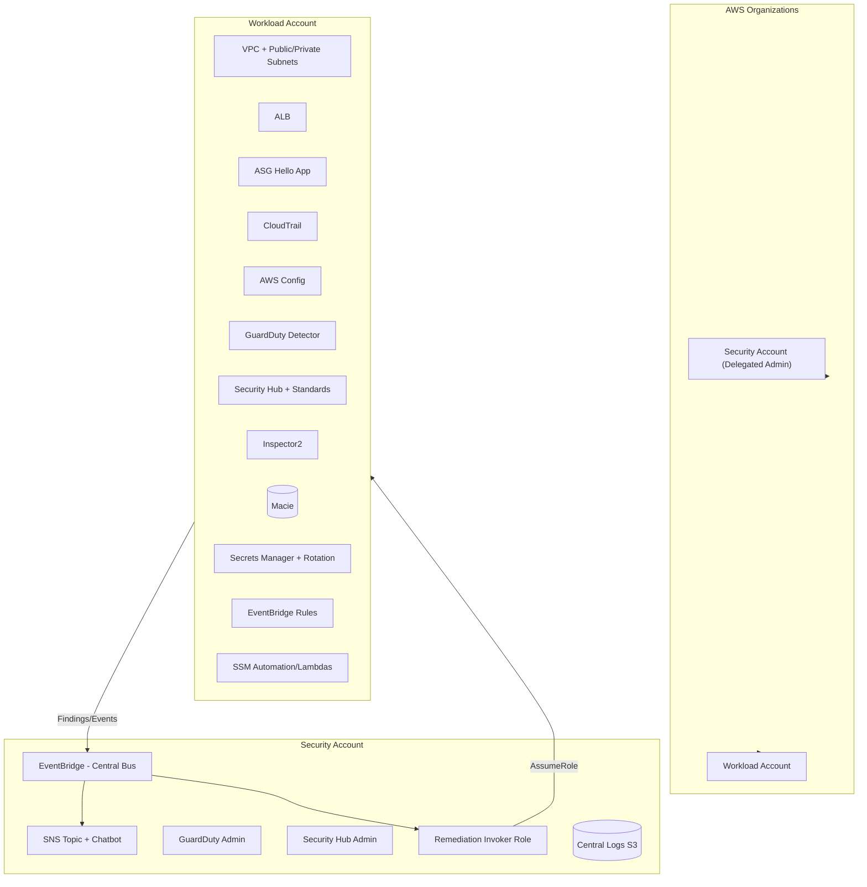

# Architecture (Multi-Account, Paid Services)

```mermaid
flowchart TD
  subgraph ORG["AWS Organizations"]
    SEC["Security Account (Delegated Admin)"]
    WRK["Workload Account"]
  end

  subgraph SECACC["Security Account"]
    EBSEC[EventBridge - Central Bus]
    SNS[SNS Topic + Chatbot]
    GDAdmin[GuardDuty Admin]
    SHAdmin[Security Hub Admin]
    RemRole[Remediation Invoker Role]
    Logs[(Central Logs S3)]
  end

  subgraph WRKACC["Workload Account"]
    VPC[VPC + Public/Private Subnets]
    ALB[ALB]
    ASG[ASG Hello App]
    CT[CloudTrail]
    CFG[AWS Config]
    GDD[GuardDuty Detector]
    SH[Security Hub + Standards]
    INS[Inspector2]
    MACIE[(Macie)]
    SECRETS[Secrets Manager + Rotation]
    EBWRK[EventBridge Rules]
    SSM[SSM Automation/Lambdas]
  end

  ORG --> SEC
  ORG --> WRK

  WRKACC -->|Findings/Events| EBSEC
  EBSEC --> SNS
  EBSEC --> RemRole
  RemRole -->|AssumeRole| WRKACC
```
